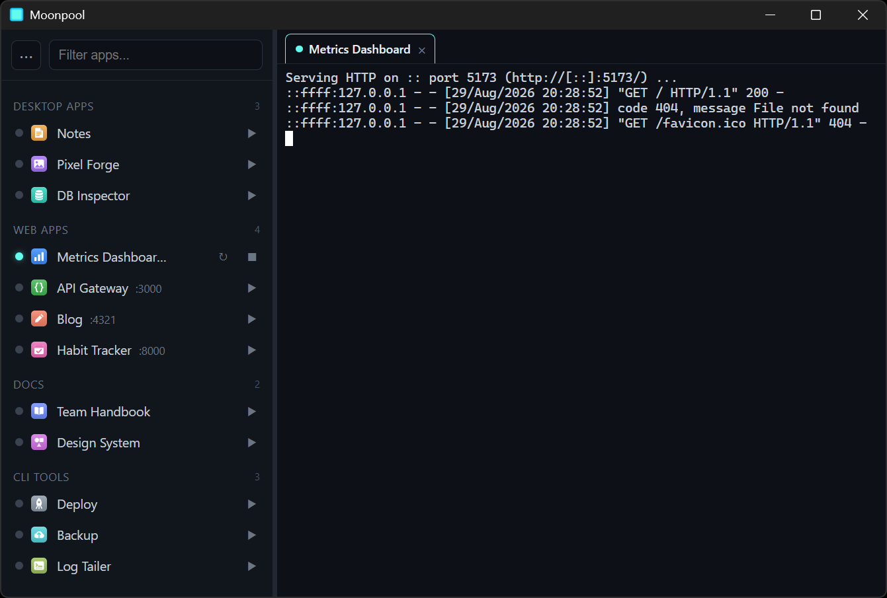

# Moonpool

[](https://github.com/kjustinkeener/Moonpool/actions/workflows/ci.yml)
[](LICENSE)
[](https://tauri.app)

A resident **system-tray launcher hub** for the apps and dev servers on your machine.
Instead of hunting down Desktop shortcuts and remembering `localhost` ports, Moonpool lists
every app you register, shows live status, and launches each one inside an **embedded
terminal** so you see its console output as if you'd opened the CLI yourself, bidirectional
(you can type into it too).

<!--
  HERO IMAGE: drop a real screenshot at assets/screenshot.png (it does not exist yet).
  A window shot showing the grouped sidebar on the left and an app's embedded terminal on
  the right works best. See assets/README.md.
-->


<!--
  DEMO GIF: drop a short screen recording at assets/demo.gif (it does not exist yet):
  pick an app, watch it launch in the embedded terminal, then stop it. See assets/README.md.
-->
<!--  -->

Built with Tauri v2 + Svelte 5. **Cross-platform:** the OS-specific bits (shell wrapper,
process/tree kill, port freeing, exe-icon extraction) live behind a small `platform` module with
Windows and Unix implementations. Windows is the primary/tested target; Linux and macOS are
supported but need testing on those platforms. Notes: desktop-app **icon extraction from the
binary is Windows-only** (elsewhere it falls back to project-folder icons + favicons), and the
Linux system tray needs `libayatana-appindicator` installed.

## Contents

- [What it does](#what-it-does)
- [Install](#install)
- [Configuring your apps](#configuring-your-apps)
- [Build from source](#build-from-source)
- [Security / trust model](#security--trust-model)
- [License](#license)

## What it does

- **One window, every app.** A grouped, searchable sidebar driven by a single JSON manifest.
- **Launch = run the real command in a PTY.** Clicking an app runs its launch command inside a
  real pseudo-terminal (ConPTY on Windows) and streams the bytes to an xterm.js terminal tab.
  Colors, build progress, and errors all show up live; you can type into it.
- **Live status.** A background poller marks each app running/stopped via a TCP port
  health-check (web apps) or a process-name check (desktop apps), even if you launched it
  outside Moonpool.
- **Start / stop / restart** with a busy indicator; stopping tree-kills the process and frees
  the port. Recently-used apps sort to the top of their group.
- **Stays in the tray.** Closing the window hides to the tray; left-click the tray icon to
  reopen, tray menu -> Quit to exit.
- **Linux-style terminal clipboard**: select to copy (then deselect), middle-click to paste.
- **Command-line remote control.** With Moonpool running, `Moonpool.exe launch|stop|restart|reload|refresh-icons|show|dump <app-id>` drives the resident window (a script or AI agent can start/stop your apps), and a live `state.json` in the config folder reports what's running. Tag a command with `--ticket <key>` to read its success/failure back from `state.json`, and `dump <app-id>` writes that app's console output to a file. Moonpool is also its own MCP server (`moonpool.exe mcp`), so an agent can list, launch, restart and read the console output of your apps as tool calls. See [`AI-README.md`](AI-README.md).

## Install

Prebuilt installers are published on the
[**Releases page**](https://github.com/kjustinkeener/Moonpool/releases). Download the artifact for your OS:

| OS | Download | Notes |
| --- | --- | --- |
| **Windows** | `.msi` or `.exe` (NSIS) | Recommended for end users. |
| **Linux** | `.deb` or `.AppImage` | See [docs/linux-setup.md](docs/linux-setup.md) for GNOME tray setup and runtime deps. |
| **macOS** | build from source | Not yet distributed or tested; see [Build from source](#build-from-source). |

Moonpool ships an auto-updater: once installed, it checks the Releases feed and can update
itself in place.

## Configuring your apps

Moonpool reads a user-editable manifest from your config directory:

```text
%APPDATA%\Moonpool\apps.json      (Windows)
~/.config/Moonpool/apps.json      (Linux)
```

On first run it's seeded from [`apps.example.json`](src-tauri/resources/apps.example.json).
Use the **⋯ menu** (top-left of the sidebar): **Add app** (a form), **Edit apps.json** (opens the
file), then **Reload** - no rebuild needed. Or hand the copyable prompt on the empty pane to an AI
agent and let it configure your apps (see [`AI-README.md`](AI-README.md)).

Each entry:

```jsonc
{
  "id": "myapp",                 // unique slug
  "name": "My App",
  "group": "Web apps",           // any label; groups render in first-seen order
  "type": "web",                 // desktop | web | static | cli
  "cwd": "C:\\path\\to\\app",
  "command": "npm run dev",      // run through cmd /c (sh -c on Linux/macOS)
  "port": 3000,                  // web: status + browser-open
  "url": "http://localhost:3000",
  "openBrowser": true,
  "env": { "PORT": "3000" },     // optional vars injected into the command
  "processName": "myapp",        // desktop: status by process name
  "note": "shown as a tooltip"
}
```

`type` semantics:
- **desktop** - status detected by `processName` (its `.exe`, without extension).
- **web** - status by `port` (TCP health-check); the browser opens when it goes live.
- **static** - opens `url` (or runs `command` then exits).
- **cli** - opens an interactive shell in `cwd`.

**Command tips:** every `command` runs via `cmd /c` (Windows) or `sh -c` (Linux/macOS) in `cwd`,
inheriting the environment plus `env`. Prefer a foreground command that streams logs
(`python x.py`, `node server.js`) over a detached/windowless launcher. Avoid nested double-quotes
(they get mangled through the wrapper); to run a one-shot command and keep a shell open, use the
unquoted form `pwsh -NoExit -Command <tokens...>`.

**Icons:** resolved as: manifest `"icon"` (file path / URL / data URI) ->
`%APPDATA%\Moonpool\icons\<id>.png` -> **auto-discovered from the app's own project folder**
(Tauri `src-tauri/icons/`, Electron `build/icon`, web `public/favicon`, or `icon.png`/`logo.png`)
-> desktop exe icon -> web favicon -> a type glyph. Most apps get their real icon with no config.

## Build from source

**Prerequisites:** [Rust](https://rustup.rs) (stable), [Node.js](https://nodejs.org) 20+, and the
[Tauri v2 system prerequisites](https://v2.tauri.app/start/prerequisites/) for your OS (on Windows:
the Microsoft C++ Build Tools and WebView2, which ships with Windows 11). Linux users: see
[docs/linux-setup.md](docs/linux-setup.md) for the exact `apt` packages. macOS users: install the
Xcode Command Line Tools per the Tauri prerequisites (Moonpool is not yet distributed or tested on
macOS, so building from source is currently the only path there).

```bash
npm install
npm run tauri dev
```

`npm run tauri build` produces the bundled release artifacts under
`src-tauri/target/release/bundle/` (`.msi`/`.exe` on Windows, `.deb`/`.AppImage` on Linux).

## Security / trust model

Moonpool runs the `command` of each app in `apps.json` **with your full user privileges**, in a
real shell (`cmd /c` on Windows, `sh -c` on Linux/macOS). There is no sandbox: an entry can run
any program, script, or shell pipeline you could run yourself.

Treat `apps.json` like a shell script you are about to execute:

- Only add or edit entries whose `command` and `cwd` you understand and trust.
- If you let an **AI agent** populate `apps.json` (see [`AI-README.md`](AI-README.md)), review the
  commands it wrote before launching them, the same way you would review a script an agent
  generated. The agent guide invites automated edits, so this review step is on you.
- Be cautious with an `apps.json` you did not write yourself (for example one copied from
  elsewhere); read every `command` first.

## License

MIT - see [LICENSE](LICENSE).
