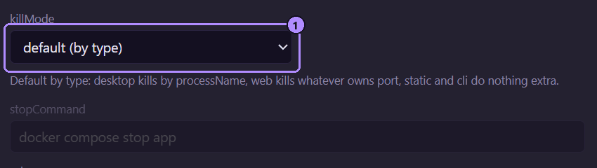

Stop always does this first: Moonpool ends the terminal it started for the app, including
everything that terminal launched. For many apps that is all that is needed.

Some apps outlive that terminal (a desktop window detaches from the dev server that
launched it, or a server subprocess keeps holding its port). **`killMode`** chooses one
extra step that runs afterward.

| `killMode` | Extra step on Stop | Reads | Default for |
| --- | --- | --- | --- |
| `processName` | Force-kills every process with that name. On Windows its children too (`taskkill /IM <name>.exe /T /F`). Elsewhere `pkill -KILL -x <name>`: an exact, case-sensitive name match, children not included. | `processName` | `desktop` |
| `port` | Force-kills whatever process is listening on `port`. | `port` | `web` |
| `command` | Runs `stopCommand` in `cwd` and waits for it to finish. | `stopCommand`, `cwd`, `env` | nothing |
| `none` | Nothing. | nothing | `static`, `cli` |

Omit `killMode` to get the default for the app's type, and set it only when Stop leaves
something running.



1. The `killMode` select. "default (by type)" is the same as omitting the key.

- If the field the mode needs is empty (`port` mode with no `port`, for example), the extra
  step is skipped. It is not an error.
- `killMode` is independent of `type`: `port` works on a `cli` app, `processName` on a
  `web` app.
- An empty string or an unrecognized value does nothing extra. It does not fall back to the
  type default.

For a desktop app, `processName` mode runs the equivalent of:

```powershell frame="terminal"
taskkill /IM notes-app.exe /T /F
```

## Several Moonpools, or your own processes

`processName` and `port` do not know who started a process. `processName` kills every
process with that name, and `port` kills whatever is listening on the port, including one
another Moonpool copy started (the installed one and portable copies run independently; see
[Portable mode](/data/portable-mode/#several-copies-at-once)) and one you started yourself.
Use these modes only for apps that will not clash that way: a name or port nothing else on
the machine uses. If two copies register the same app, or you also run it by hand, give it
`killMode` `none` or a `command` that stops only its own instance.

## stopCommand

Used only when `killMode` is `command`. It runs through `cmd /c` on Windows and `$SHELL -c`
elsewhere, in `cwd`, with your `env` added. `{MP_HOME}` and `{MP_DATA}` work in it. Moonpool
waits for it to finish before doing anything else, so a Restart never relaunches while it
is still running. Its exit code is ignored. If it is still running after 60 seconds,
Moonpool kills it and its children and carries on.

## Restart

Restart is Stop followed by Launch of the same `command`. Moonpool waits up to 4 seconds for
the old instance to read as stopped (so its port is free) before relaunching. A `static`
entry with only a `url` has nothing to stop: Restart just opens the page again.

## Docker apps on Windows

Use `none`, or `command` with a real stop command such as `docker compose stop app`. Do not
use `port`.

Docker Desktop publishes every container's port through one shared background process. On
Windows, "whatever is listening on the port" is that shared process, so `port` mode would
force-kill Docker Desktop and take down every container, not just this app. As a backstop,
Moonpool refuses to kill a fixed list of shared Windows processes by port: Docker Desktop's
backend, proxy and service processes, `dockerd`, `vpnkit`, the WSL host processes, and core
system processes such as `svchost`. That is not a substitute for choosing the right mode.

If your `command` already recreates the container (`docker compose up -d --build`), `none`
is correct: Restart just runs it again.

## Examples

A dev server that sometimes leaves a node process holding its port (this is the default for
`web`, shown here explicitly):

```json title="apps.json"
{ "id": "site", "name": "Site", "group": "Web apps", "type": "web",
  "cwd": "C:\\code\\site", "command": "npm run dev", "port": 5173,
  "killMode": "port" }
```

A Docker Compose app:

```json title="apps.json"
{ "id": "api", "name": "API", "group": "Web apps", "type": "web",
  "cwd": "C:\\code\\api", "command": "docker compose up -d --build", "port": 8080,
  "killMode": "command", "stopCommand": "docker compose stop app" }
```
