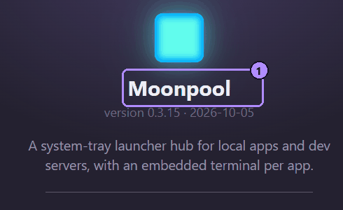

Moonpool se actualiza solo. No hay un instalador aparte que descargar ni un asistente por el que avanzar.

## Cómo llegan las actualizaciones

Moonpool obtiene `update.json` (`linux-update.json` en Linux) de los Releases de GitHub del proyecto,
compara versiones y solo ofrece una estrictamente más nueva. Busca:

- al arrancar, salvo que **Buscar actualizaciones al iniciar** esté desactivado en
  [Ajustes](/es/using/settings/);
- siempre que pulses **Buscar actualizaciones** en la ventana Acerca de. Ese botón instala de inmediato
  una versión más nueva y reinicia Moonpool. Si no la hay, dice que tienes la última versión o muestra el error.

La ventana Acerca de muestra la versión que ejecutas, bajo el nombre:



1. El nombre. La línea de debajo es la versión y la fecha de compilación.

Cada descarga se verifica con la clave de firma minisign de Moonpool antes de aplicarse, de modo que una
descarga manipulada o dañada se rechaza. Moonpool nunca instala una versión anterior.

## El aviso de actualización

Al arrancar, una actualización encontrada se muestra como un aviso en la pantalla vacía del hub:

```text
Moonpool {version} ya está disponible (tienes la {current}).
```

El aviso solo se muestra mientras no hay ninguna pestaña de app abierta y el panel CLI está expandido. Con
el panel contraído, parpadea en su lugar la flecha junto al cuadro de filtro. Con una pestaña abierta no
hay ninguna señal. Para ver el aviso, cierra todas las pestañas (y expande el panel), o usa **Buscar
actualizaciones** en la ventana Acerca de.

Haz clic en **Descargar e instalar** y Moonpool se reemplaza y se reinicia, o descarta el aviso con la x.

## Copias portables

Una copia portable actualiza el `moonpool.exe` de su propia carpeta `.moonpool\` de la misma forma. Cada
copia busca y se actualiza por su cuenta. La carpeta debe ser escribible, así que una copia en una memoria
o un recurso compartido de solo lectura no puede actualizarse; copia a mano un `moonpool.exe` más nuevo
encima.

## Linux

Solo el AppImage se actualiza solo. Reemplaza el archivo AppImage en su sitio, así que guárdalo en una
carpeta en la que puedas escribir. Una instalación `.deb` o RPM la actualiza tu gestor de paquetes:
instalar desde Moonpool falla con

```text
automatic updates are available for the AppImage only; update the .deb or RPM with your package manager
```

(las actualizaciones automáticas solo están disponibles para el AppImage; actualiza el .deb o el RPM con
tu gestor de paquetes). Consulta [Linux](/es/platforms/linux/#actualizaciones).

## Cuando falla una actualización

El aviso muestra el motivo y el botón vuelve a estar disponible para que puedas reintentarlo:

```text
Error al actualizar: <error>
```

| El error contiene | Causa probable | Qué hacer |
| --- | --- | --- |
| `download failed` | Sin conexión, un proxy, o GitHub limitando las solicitudes | Espera y reintenta, o actualiza a mano. |
| `signature verification FAILED - refusing to install` | La descarga está dañada o se modificó | Reintenta. Si sigue fallando, actualiza a mano desde la página de Releases. |
| `rename self aside` o `write new exe` | La carpeta es de solo lectura, o un antivirus retiene el archivo | Haz la carpeta escribible, o permite `moonpool.exe` en tu antivirus, y reintenta. |
| `refusing to install ... not newer than current` | La versión ofrecida no es más nueva | No hay nada que hacer. |

### Actualizar a mano

Sal de Moonpool, descarga `moonpool.exe` de la
[página de Releases](https://github.com/kjustinkeener/Moonpool/releases) del proyecto y cópialo sobre el
anterior: `%USERPROFILE%\.moonpool\moonpool.exe` en una instalación, o el de tu carpeta `.moonpool\` en
una copia portable. Tu carpeta de configuración no se toca. En Linux, reemplaza el AppImage o usa tu
gestor de paquetes.

## La ayuda también se actualiza

Esta ayuda se distribuye dentro de Moonpool, así que cada actualización del programa trae la ayuda
correspondiente. La copia sin conexión siempre coincide con la versión que ejecutas.

## Véase también

- [Novedades](/es/getting-started/whats-new/)
- [Ventana de Ajustes](/es/using/settings/)
