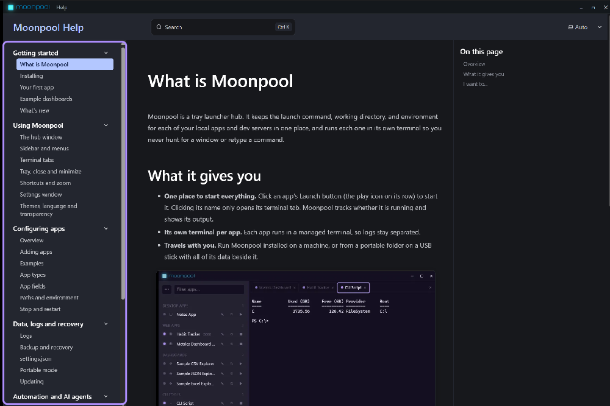

## 1. Inicia Moonpool

En Windows, ejecuta `moonpool.exe` y haz clic en **Instalar Moonpool** (consulta
[Instalación](/es/getting-started/install/)). En Linux, inicia el AppImage o el paquete instalado.

La primera vez que se ejecuta, Moonpool llena la barra lateral con apps de ejemplo (el Bloc de notas en
Windows, un shell, un pequeño servidor web y los paneles incluidos). Se ejecutan tal cual (el servidor
web necesita Python), así que puedes probarlas y luego editarlas o eliminarlas. También coloca un icono
en la bandeja del sistema. En Windows, si no ves el icono, haz clic en la flecha **^** a la derecha de
la barra de tareas.

## 2. Añade tu app

1. Abre el menú **...** en la parte superior de la barra lateral y elige **Añadir app**.
2. Escribe un **name**. El grupo empieza como `Web apps`; déjalo o elige otro.
3. Deja **type** en `web` si es un servidor de desarrollo.
4. Establece **cwd** con la carpeta de tu proyecto y **command** con lo que escribes para iniciarlo, por
   ejemplo `npm run dev`.
5. Establece **port** con el puerto en el que escucha y **url** con la página que se abrirá.
6. Guarda.

Los detalles de cada campo están en [Añadir apps](/es/apps/add-an-app/).

## 3. Iníciala

Haz clic en el botón **Iniciar** de la app (el icono de reproducir en su fila). Se abre su pestaña de
terminal y muestra la salida. El punto de estado parpadea mientras la app se está iniciando y se queda
fijo cuando su puerto responde. Si **openBrowser** está activado, se abre la página.

Al hacer clic en el nombre de la app solo se abre su pestaña de terminal. Nunca inicia la app.

## 4. Deténla

Haz clic en el botón **Detener** (el cuadrado) de la fila. El punto se vuelve gris.

Si algo sigue en ejecución después de Detener, consulta [Detener y reiniciar](/es/apps/stop-and-restart/).

## Deja que lo haga un agente

Cuando no hay ninguna pestaña abierta, el panel CLI muestra un botón **Copiar el prompt**. Pega el prompt
en un agente de IA y él encuentra tus apps y las añade. Consulta
[Agentes de IA: inicio rápido](/es/automation/quick-start/).

## Cómo volver a encontrar el hub

- Haz clic izquierdo en el icono de la bandeja para mostrar el hub. Con el clic derecho se abre un menú
  con **Mostrar Moonpool** y **Salir**.
- De forma predeterminada, al cerrar la ventana se sale de Moonpool. Activa **Cerrar a la bandeja** en
  Ajustes para ocultarlo en la bandeja y mantenerlo en ejecución. Consulta
  [Bandeja, cerrar y minimizar](/es/using/tray-and-closing/).

## Cómo obtener ayuda

**Ayuda**, en el menú **...** de la parte superior de la barra lateral, abre esta ayuda en su propia
ventana. Funciona sin conexión y siempre coincide con la versión que usas.

## Siguiente

- [Añadir apps](/es/apps/add-an-app/)
- [Solución de problemas](/es/support/troubleshooting/)
