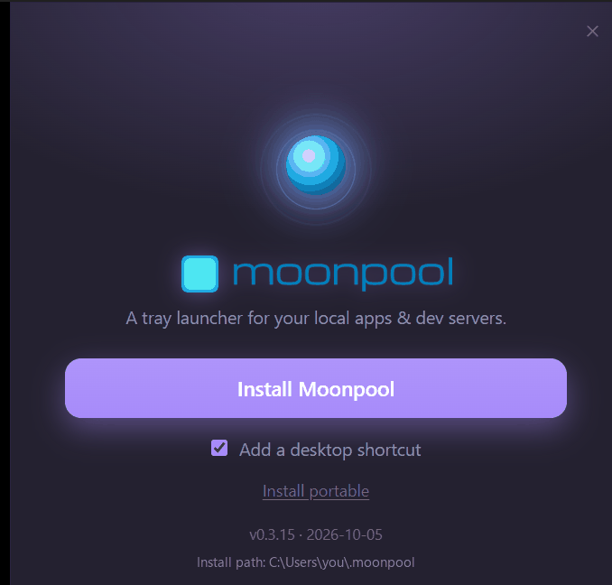

Portable mode keeps Moonpool and everything it writes inside one `.moonpool\` folder, so
you can carry it on a USB stick or drop it in a synced folder and run it on any PC.

## How it works

When you install portably, Moonpool creates a `.moonpool\` folder inside the location you
choose. That folder holds the program, your configuration, and its help content. Nothing
is written to Windows AppData, so moving or copying the folder moves your whole setup with
it.

```text
<chosen location>\.moonpool\
```

## What is different from installed

| | Installed | Portable |
| --- | --- | --- |
| Program | `%USERPROFILE%\.moonpool\moonpool.exe` | `<chosen location>\.moonpool\moonpool.exe` |
| Config folder | `%USERPROFILE%\.moonpool\moonpool-config\` | `<chosen location>\.moonpool\moonpool-config\` |
| Window browser profile, window size and position | In the config folder | In the config folder, so they travel too |
| Start Menu, desktop shortcut, Add/Remove entry | Yes | None |
| Updates | Replaces its own exe | The same, inside the `.moonpool\` folder. See [Updating](/guides/updating/#portable-copies). |
| Remove | Add/Remove Programs or `--uninstall` | Delete the folder |

Neither mode writes to Windows AppData.

### Synced folders

You can keep a portable copy in a synced folder (OneDrive, Dropbox and the like), but run it
on one PC at a time. Moonpool writes `state.json` every couple of seconds and logs as apps
run, so two PCs running the same folder fight over the same files, and a sync conflict can
leave a broken `apps.json`. Quit it on one PC before starting it on another.

## Several copies at once

One Moonpool runs per folder. The installed Moonpool and any number of portable copies, each
in its own folder, can run at the same time, and each is fully separate: its own apps, tray
icon, window, settings, logs and [control channel](/automation/control-verbs/).

- The tray tooltip and the taskbar name say which copy is which: `Moonpool` for the
  installed one, `Moonpool (<folder>)` for a portable one, where `<folder>` is the folder you
  chose (the one that holds `.moonpool\`).
- Starting the same copy a second time brings its window back instead of opening another
  one. Starting a different copy opens that copy.
- To give an AI agent more than one copy, register each under its own name; see
  [MCP setup](/automation/mcp-setup/#more-than-one-moonpool).
- Moving or renaming a portable folder gives it a new identity (a new control-channel name).
  Quit it before you move it.
- Copies do not know about each other's apps. Two copies that both start the same server on
  the same port will still clash, and a Stop that works by process name or port can end
  something another copy started; see
  [Stop and restart](/configuration/stop-and-restart/#several-moonpools-or-your-own-processes).

## Making your apps travel too

Use the `{MP_HOME}` token in an app's path so it points inside the portable folder rather
than at a fixed location on one machine. In a portable copy `{MP_HOME}` is the folder that
holds `moonpool.exe`, which is the `.moonpool\` folder itself, not the folder you chose:

```json title="apps.json"
{ "cwd": "{MP_HOME}/my-app" }
```

Here `{MP_HOME}/my-app` is `<chosen location>\.moonpool\my-app`. A path that starts with
`./` is anchored the same way. Tokens and `./` paths also work in an installed Moonpool.
See [Paths and environment](/configuration/paths-and-environment/) for how paths resolve.

## Choosing portable from the installer

Portable mode is set up from the installer card, which offers **Install portable**
alongside **Install Moonpool**.



Pick a folder and Moonpool creates the `.moonpool\` folder there, copies itself in, and
starts the new copy with a fresh configuration.

The card is also in the "..." menu as **Install Moonpool...**, in both installed and
portable mode. Using **Install portable** from there makes the running Moonpool quit and
the new portable copy start in its place. The Moonpool you started from is left where it
was, so you can start it again afterward.

A portable copy starts fresh and does not copy your existing apps. To bring them across,
quit the portable copy and copy `apps.json` by hand:

| | Path |
| --- | --- |
| From (installed) | `%USERPROFILE%\.moonpool\moonpool-config\apps.json` |
| To (portable) | `<chosen location>\.moonpool\moonpool-config\apps.json` |

Entries with absolute paths still work on the same PC, but they do not travel. The Edit app
dialog marks them "not portable".

## How Moonpool knows it is portable

A copy is portable while a file named `moonpool.portable` sits next to its `moonpool.exe`.
Nothing else marks it, and nothing is registered with Windows.

To remove a portable copy, quit it and delete its `.moonpool\` folder. `--uninstall` only
removes the installed Moonpool, never a portable copy.
