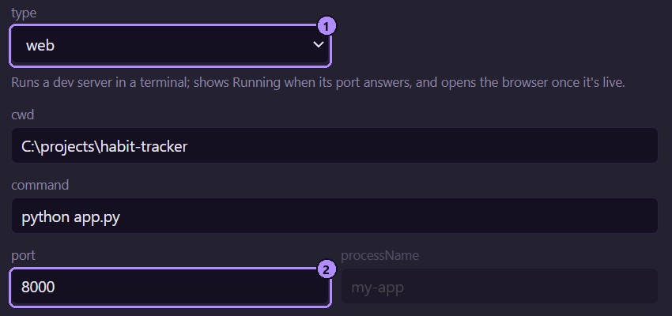
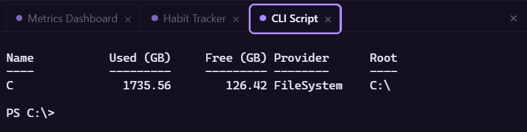

`type` は、どのフィールドが重要になるかと、停止の既定の動作を決めます。

| | `web` | `desktop` | `static` | `cli` |
| --- | --- | --- | --- | --- |
| 必要なもの | `command` | `command` | `url` | `command` |
| 通常、さらに | `port`、`url` | `processName` | 自身で配信する場合は `command` と `port` | `cwd` |
| 起動 | ターミナルタブで `command` を実行 | ターミナルタブで `command` を実行 | `command` なし: ブラウザーで `url` を開く。ある場合: ターミナルタブで実行 | ターミナルタブで `command` を実行 |
| 既定の `killMode` | `port` | `processName` | `none` | `none` |



1. `type` の選択。ヒントの行に、その type の動作が説明されています。
2. `port` 欄。`web` アプリでは、このポートが応答するかどうかで「実行中」が決まります。

## 「実行中」の判定方法

Moonpool は数秒ごとに確認します。type にかかわらず、次のいずれかに当てはまれば、アプリは「実行中」です。

- `processName` が設定されていて、その名前のプロセスが存在する。Moonpool 自身の `<exe> mcp` ヘルパープロセスは数えません。
- `port` が設定されていて、ローカルホストで応答する。
- Moonpool が起動し、`port` も `processName` もなく、ターミナルのプロセスがまだ生きている。

つまり、`cli` アプリはコマンドが動いている間は「実行中」で、`port` のない `web` アプリも同じように動作します。`url` だけの `static` エントリーは追跡するものがなく、「実行中」と表示されることはありません。

## web

ローカルサーバーです。サーバーが応答しているかどうかを「実行中」に反映するには `port` を、立ち上がったときに開くには `url` と `openBrowser` を設定します。

## desktop

ネイティブアプリです。`processName` に実行ファイル名を設定すると、起動したコマンドからウィンドウが切り離されても、「実行中」が保たれます。既定の停止は、その名前のプロセスをすべて終了します。

## static

ページです。`url` だけの場合、起動と再起動はブラウザーでページを開き、停止は何もしません。`http://`、`https://`、`mailto:`、`file://` の URL が開かれるので、ローカルのページも使えます。

```json title="apps.json"
{ "id": "csv", "name": "CSV dashboard", "group": "Docs", "type": "static",
  "url": "file:///{MP_HOME}/dashboards/examples/csv/index.html" }
```

サーバーが必要なページ (PHP や、ローカルファイルを取得するもの) には、サーバーを起動する `command` と、それを追跡する `port` が必要です。[例](/ja/apps/examples/)を参照してください。

## cli

ツールです。`command` は、`cwd` のターミナルタブで実行され、コマンドが終了すると、アプリは「実行中」でなくなります。シェルを開いたままにするには、たとえば次の `command` のように、コマンドをシェルにします。

```text title="command"
pwsh -NoLogo -NoProfile -NoExit -Command python run.py --flag
```

`command` の中で二重引用符を入れ子にするのは避けてください。`cmd /c` のラッパーが壊してしまいます。



## クリックしたときの動作

アプリの名前をクリックすると、そのターミナルタブが開くだけです。実行するには、起動、停止、再起動のボタンを使います。[アプリの状態](/ja/support/glossary/#アプリの状態)を参照してください。
