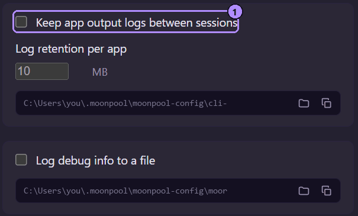

Moonpool は 4 種類の出力を保持します。

| 種類 | 場所 | 保持 |
| --- | --- | --- |
| セッションログ | 設定フォルダー内の `cli-output\<id>\<session-start-ms>.log` | 今回のセッションのものは常に保持。以前のセッションのものは下記の保持ルールに従います。 |
| `moonpool.log` | 設定フォルダー | **デバッグ情報をファイルに記録**がオンの間だけ書き込まれます。 |
| ダンプ | 指定した場所、またはセッションログ自身のパス | 削除するまで |
| スクロールバック | ターミナルタブ内 | 10,000 行、Moonpool を終了するまで |

設定フォルダーは[設定の保存場所](/ja/apps/apps-json/#設定の保存場所)に載っています。

## セッションログ

アプリがターミナルに出力するものはすべて、ログファイルにも書き込まれます。

```text
<config folder>\cli-output\<id>\<session-start-ms>.log
```

- アプリごと、Moonpool のセッションごとに 1 ファイルです。数字は、その Moonpool プロセスが起動した時刻です。
- アプリを停止して再び起動しても、同じファイルに追記され続けます。新しい実行が始まる位置には薄い区切り線が入り、同じ印がターミナルタブにも表示されます。

  ```text title="1767225600000.log"
  Local:   http://localhost:5173/
  ---------- restarted 2026-10-05 09:14:02 ----------
  Local:   http://localhost:5173/
  ```

- `id` のうち英字、数字、`-`、`_` 以外の文字は、フォルダー名では `_` になります。たとえば `.` は `_` になります。英語以外の文字は保持されます。
- ファイルには、色のコードを含む生のターミナル出力が入っています。プレーンテキストが必要なときは、ダンプを使ってください。

アプリのタブを開き直すと、今回のセッションのログが再生され、それ以前の出力が見えます。

## 保持

保持の対象になるのは、以前の Moonpool セッションのログだけです。アプリを起動するときに、そのアプリのフォルダーに対してのみ、古いものから順に実行されます。

| **アプリの出力ログをセッション間で保持**(`cliLogging`) | 以前のセッションのログはどうなるか |
| --- | --- |
| オフ(既定) | そのアプリの次回起動時に削除されます。 |
| オン | フォルダーの合計サイズが**アプリごとのログ保持サイズ**(`logRetentionMb`、既定 10 MB)を超えるまで保持され、超えると古いものから削除されます。 |

今回のセッションのファイルもその合計に含まれますが、削除や切り詰めはされません。そのため、今回のログが非常に大きいと、以前のログがすべて押し出されることがあります。



1. **アプリの出力ログをセッション間で保持**は `cliLogging` です。その下の**アプリごとのログ保持サイズ**は `logRetentionMb` です。

## moonpool.log

**デバッグ情報をファイルに記録**(`debugLogging`)をオンにすると、Moonpool は設定フォルダーの `moonpool.log` に、タイムスタンプ付きの行を追記します。内容は、`apps.json` の読み込み、起動(コマンドとフォルダー付き)、制御コマンド、エラーです。問題を再現する前にオンにしてください。

## 開く操作とコピー操作

[設定](/ja/using/settings/#右の列-ログ)の各ロググループの下にあります。

- **CLI ログフォルダーを開く**と**ログを開く**は、ファイルマネージャーでそのフォルダーを開きます。
- **CLI ログフォルダーのパスをコピー**と**ログファイルのパスをコピー**は、パスをクリップボードにコピーします。

ターミナルタブでは、**すべてコピー**がスクロールバック全体をテキストとしてコピーします。

## ダンプ

`dump` 動詞を使うと、スクリプトからセッションログを取得できます。

```powershell frame="terminal"
& "$env:USERPROFILE\.moonpool\moonpool.exe" dump my-app C:\temp\my-app.log
```

出力パスを指定すると、色のコードを取り除いたプレーンテキストのコピーが書き込まれます。指定しなければ、セッションログ自身のパスが報告されます。エージェントは、`moonpool_app_output` から同じテキストを、すでに整形された状態で受け取れます。[コマンドライン](/ja/automation/command-line/)を参照してください。
