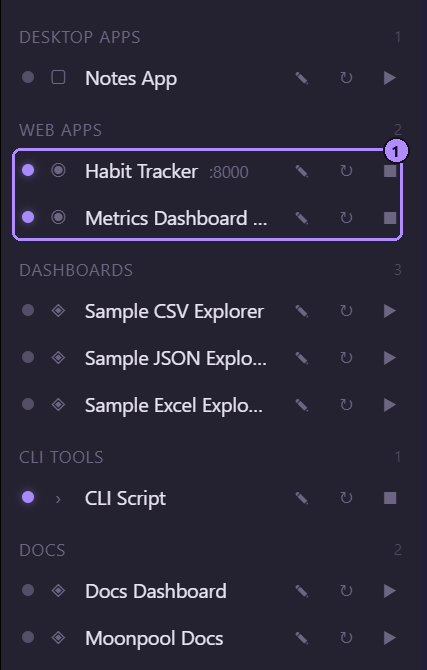
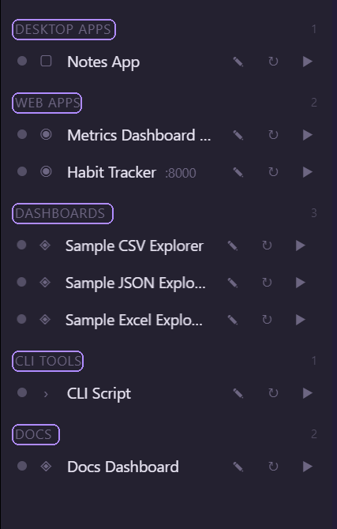

Pasek boczny wymienia każdą aplikację z `apps.json`, pogrupowaną według pola `group` aplikacji. Zob. [Pola aplikacji](/pl/apps/fields/).

## Wiersze

Każdy wiersz pokazuje kropkę stanu, ikonę aplikacji (lub symbol typu, jeśli nie ma ikony), nazwę, port, jeśli jest ustawiony (`:3000`), oraz kontrolki.

| Kropka | Znaczenie |
| --- | --- |
| Pełna | działa |
| Pulsująca | uruchamianie: Moonpool uruchomił aplikację, ale jeszcze nie wykryto, że działa |
| Szara | zatrzymana |

Po najechaniu na kropkę wyświetla się odpowiednie słowo.



1. Dwie działające aplikacje. Ich kropki są zapalone, a Zatrzymaj (kwadrat) zastępuje Uruchom.

| Kontrolka | Działanie |
| --- | --- |
| Ołówek | Edytuje aplikację. |
| Uruchom ponownie | Zatrzymuje i uruchamia ponownie. Przy zatrzymanej aplikacji po prostu ją uruchamia. |
| Uruchom (odtwarzanie) | Uruchamia aplikację i otwiera jej kartę terminala. Widoczny, gdy aplikacja jest zatrzymana. |
| Zatrzymaj (kwadrat) | Zatrzymuje aplikację. Widoczny, gdy działa lub się uruchamia. |


1. Kropka stanu (zapalona, gdy aplikacja działa).
2. Ikona typu.
3. Edycja (ołówek).
4. Uruchom ponownie.
5. Zatrzymaj (widoczny zamiast Uruchom, gdy aplikacja działa).

Gdy trwa uruchamianie lub zatrzymywanie, kontrolki są zastępowane wskaźnikiem postępu (`Pracuję...`).

Kliknięcie **nazwy** aplikacji otwiera lub aktywuje jej kartę terminala i niczego nie uruchamia. Karta zatrzymanej aplikacji pokazuje dziennik z bieżącej sesji. Aby ją uruchomić, należy użyć Uruchom lub Uruchom ponownie. Aplikacja `static` mająca tylko `url` i niemająca `command` nie ma terminala: Uruchom otwiera adres URL w przeglądarce.

### Podpowiedź

Najechanie na nazwę pokazuje `note` aplikacji, jeśli je ma, a w przeciwnym razie jej nazwę. `note` ustawia się w edytorze lub w `apps.json`.

### Podrzędny wiersz MCP

Gdy klient AI użył własnych narzędzi MCP aplikacji, pod aplikacją pojawia się przyciemniony wiersz
podrzędny `Serwer MCP`. Jego kropka jest zapalona, a podpowiedź brzmi „Klient MCP połączony”, dopóki
klient jest podłączony. Przycisk zatrzymania kończy ten proces.

Wiersz znajduje proces według `processName` oraz argumentu `mcp` albo według wzorca
`mcpProcessName` aplikacji, jeśli jest ustawiony. Zob. [pola](/pl/apps/fields/#mcpprocessname).

Te wiersze można ukryć opcją **Pokaż procesy MCP** w Ustawieniach. Zob.
[Konfiguracja MCP](/pl/automation/mcp-setup/#aplikacje-z-własnym-serwerem-mcp).

## Grupy



- Kliknięcie nagłówka grupy zwija lub rozwija ją. Liczba obok to liczba pokazanych aplikacji. Zwinięte grupy są zapamiętywane.
- W obrębie grupy na górze znajduje się ostatnio uruchomiona aplikacja. Aplikacje nigdy nieuruchamiane zachowują kolejność z `apps.json`. Świeżo uruchomiona aplikacja świeci się i przesuwa na górę.

## Pole filtru

Wpisanie tekstu w **Filtruj aplikacje...** zawęża listę. Dopasowuje nazwę aplikacji i nazwę grupy, bez względu na wielkość liter. Jeśli nic nie pasuje, lista pokazuje:

```text
Żadna aplikacja nie pasuje do „<tekst>”.
```

Aplikacja pokazuje cudzysłowy typograficzne wokół tekstu, tutaj i w poniższym pytaniu o usunięcie.

## Menu prawego przycisku

Kliknięcie wiersza prawym przyciskiem otwiera:

| Pozycja | Działanie |
| --- | --- |
| Edytuj | Otwiera edytor aplikacji. |
| Zmień nazwę | Zamienia nazwę w pole edycji. **Enter** lub kliknięcie poza polem zapisuje, **Esc** anuluje. Pusta lub niezmieniona nazwa jest ignorowana. |
| Wybierz ikonę... | Wybór pliku obrazu (png, jpg, jpeg, gif, svg, webp, ico) używanego jako ikona. |
| Usuń | Pyta `Usunąć „<nazwa>”?` i usuwa wpis z `apps.json`. Jeśli Moonpool uruchomił aplikację, zostaje ona najpierw zatrzymana. |

**Esc** zamyka menu bez wykonywania czynności.

## Zmiana szerokości

Należy przeciągnąć separator między paskiem bocznym a panelem CLI. Szerokość jest ograniczona do 180-620 px (domyślnie 280) i zapamiętywana. Separator jest zablokowany, gdy panel CLI jest zwinięty. Zob. [Karty terminala](/pl/using/terminal-tabs/).
