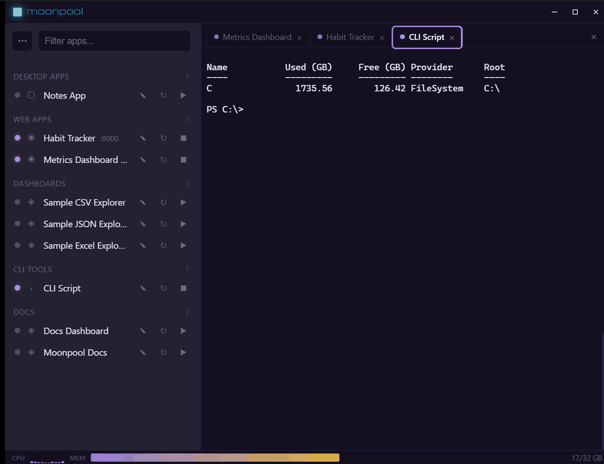

O Moonpool é um hub de inicialização na bandeja do sistema. Ele guarda em um só lugar o comando de
inicialização, o diretório de trabalho e o ambiente de cada um dos seus apps locais e servidores de
desenvolvimento, e executa cada um em seu próprio terminal, para que você nunca precise procurar uma
janela nem digitar um comando de novo.

## O que ele oferece

- **Um só lugar para iniciar tudo.** Clique no botão Iniciar de um app (o ícone de reproduzir na
  linha dele) para iniciá-lo. Clicar no nome só abre a aba de terminal dele. O Moonpool acompanha se
  ele está em execução e mostra a saída.
- **Um terminal próprio para cada app.** Cada app roda em um terminal gerenciado, então os logs
  ficam separados.
- **Vai com você.** Use o Moonpool instalado em uma máquina ou a partir de uma pasta portátil em um
  pen drive, com todos os dados ao lado.

## Quero...

| Quero | Ir para |
| --- | --- |
| Instalar o Moonpool | [Instalação](/pt-br/getting-started/install/) |
| Colocar um app para rodar, do começo ao fim | [Seu primeiro app](/pt-br/getting-started/first-app/) |
| Adicionar ou alterar um app | [Adicionar apps](/pt-br/apps/add-an-app/) |
| Resolver um problema | [Solução de problemas e perguntas frequentes](/pt-br/support/troubleshooting/) |
| Consultar uma mensagem de erro | [Mensagens de erro explicadas](/pt-br/support/error-messages/) |
| Executar um servidor de desenvolvimento em segundo plano no Windows | [Executar um servidor de desenvolvimento npm em segundo plano](/pt-br/guides/run-npm-dev-server-in-background-windows/) |
| Iniciar um script ou servidor de desenvolvimento no login do Windows | [Iniciar um app no login do Windows](/pt-br/guides/start-app-at-windows-login/) |
| Encontrar e encerrar o processo que usa uma porta | [Encontrar e encerrar o processo que usa uma porta](/pt-br/guides/find-and-kill-process-using-port-windows/) |
| Manter um script Python rodando em segundo plano | [Manter um script Python rodando](/pt-br/guides/keep-python-script-running-background-windows/) |
| Dar a um agente de IA um servidor MCP para meus apps | [Servidor MCP para Claude Code, Codex e Cursor](/pt-br/guides/mcp-server-for-ai-agent-to-start-stop-local-apps/) |
| Deixar um agente de IA configurar ou controlar meus apps | [Agentes de IA: início rápido](/pt-br/automation/quick-start/) |
| Executar o Moonpool a partir de um pen drive ou pasta | [Modo portátil](/pt-br/data/portable-mode/) |
| Fazer backup ou mover minha configuração | [Backup e recuperação](/pt-br/data/backup-and-recovery/) |
| Ver o que mudou | [Novidades](/pt-br/getting-started/whats-new/) |
| Consultar um termo | [Glossário](/pt-br/support/glossary/) |
