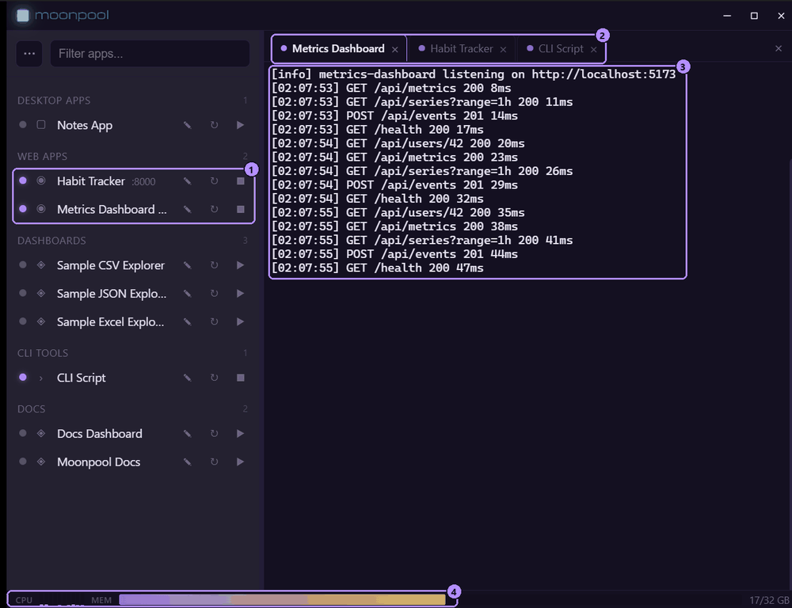
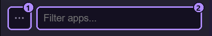

1. Two of the running apps: a lit status dot and a stop button instead of play.
2. The tab strip, one tab per opened app, with the active tab highlighted.
3. Live output from the active app.
4. The CPU and memory status bar.

## Layout

| Area | What it holds |
| --- | --- |
| Title bar | Minimize, maximize and close. |
| Sidebar | The filter box, the **...** menu, and your apps grouped by `group`. See [Sidebar and menus](/using/sidebar-and-menus/). |
| CLI pane | One terminal tab per opened app. See [Terminal](/using/terminal/). |
| Status bar | Live CPU and memory, along the bottom. |

Drag the divider between the sidebar and the CLI pane to resize the sidebar.

## Status bar

The status bar shows one thin bar per CPU core (hover for "Per-core CPU usage"), then a memory bar with a `used/total GB` label. Turn it off with **Show CPU/memory status bar** in Settings (`showStatusbar`; see [Settings window](/using/settings-window/)). The change applies immediately.

## The ... menu

The **...** button left of the filter box opens the menu.



1. The **...** menu button.
2. The **Filter apps...** box.

| Item | Does |
| --- | --- |
| Add app | Opens the app editor. See [Adding apps](/guides/adding-apps/). |
| Edit apps.json | Opens the manifest file for hand editing. |
| Reload | Re-reads `apps.json` from disk (also F5, see [Shortcuts and zoom](/using/shortcuts-and-zoom/)). |
| Settings | Opens the Settings window. |
| Help | Opens this help. |
| About | Opens the About window, with the version and update check. |
| Install Moonpool... | Windows only. Opens the installer window, to install the app or make a portable copy. See [Installing](/getting-started/installing/) and [Portable mode](/guides/portable-mode/). |

### Port conflict warning

If two apps in `apps.json` use the same `port`, a warning row appears at the bottom of the menu, for example:

```text
port 3000: App A / App B
```

Hover it for the full sentence. Fix the clash in the manifest or the editor; the row disappears once no port is shared.

## When apps.json has an error

If Reload (or F5) finds that `apps.json` no longer parses or validates, Moonpool keeps the
list it already had. A banner at the top of the sidebar says "apps.json has an error,
showing the last list that loaded", followed by the error (hover it for the full text). The
list below is dimmed but still works, so you can start and stop apps as usual. **Edit
apps.json** in the banner opens the file; fix it and choose **Reload**, and the banner goes
away.

Until the file loads again, Moonpool will not save changes from the app editor, rename,
delete or set icon, so a bad file is never overwritten.

If the file is already broken when Moonpool starts, there is no earlier list to keep: the
banner says no apps are loaded and the sidebar is empty. Fix the file and reload, or roll
back to a recent good copy (see [If the file is bad](/configuration/overview/#if-the-file-is-bad)).

## Empty screen

With no tab open, the CLI pane shows "Pick an app on the left to launch it." It also holds
two things that appear only while no tab is open:

- **The update banner**, when a newer version was found at startup. See
  [Updating](/guides/updating/).
- **Copy prompt**, a ready-made prompt that hands setting up your apps to an AI agent. See
  [AI agents: quick start](/automation/quick-start/#copy-prompt).

The tray icon, closing, minimizing, Quit and always on top are on
[Tray, close and minimize](/using/tray-and-closing/).

## Size, position and maximized state

Moonpool remembers the hub window's size, position and maximized state between runs. The
first run opens at 1200x780, at the position Windows picks.

If the saved position is no longer on any connected display (for example an unplugged monitor), the position is ignored and the saved size is used at the default location. The file is `window-state.json` in the config folder (see [Overview](/configuration/overview/#where-the-config-lives)).

The sidebar width and whether the CLI pane is collapsed are remembered too.
