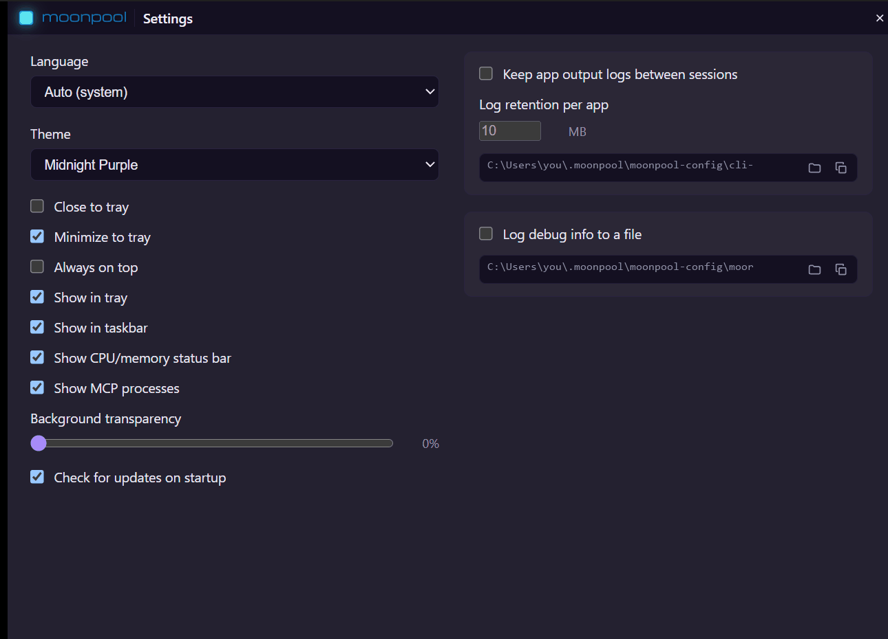
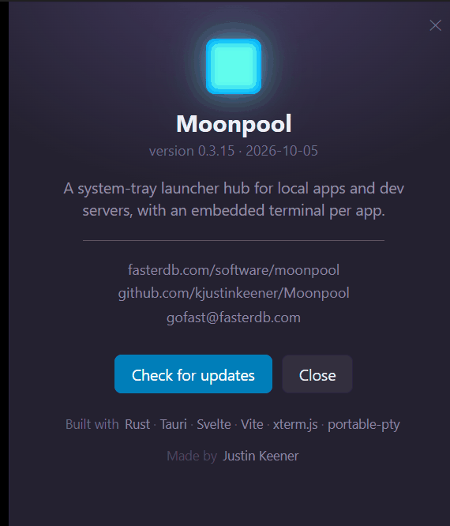

Open **Settings** from the hub's "..." menu. Changes save as you make them. Escape closes
the window. The matching `settings.json` keys and defaults are in
[Settings and logs](/configuration/settings-and-logs/).

## Resetting a control

Right-click any checkbox, slider or number field to reset just that setting to its
default. The hover tooltip on each control says so. The Language and Theme pickers have no
reset.

## Left column

| Control | Default | What it does |
| --- | --- | --- |
| Language | Auto (system) | Language of Moonpool's own text. Applies instantly. See [Appearance](/using/appearance/). |
| Theme | Auto (system) | Colour theme. The button opens a theme browser with a preview of every theme; clicking one applies it instantly. See [Appearance](/using/appearance/). |
| Close to tray | off | On: closing the window hides Moonpool to the tray. Off: closing quits. |
| Minimize to tray | on | On: minimizing hides Moonpool to the tray and it leaves the taskbar. Off: minimizes to the taskbar. |
| Always on top | off | Keeps every Moonpool window above other windows. |
| Show in tray | on | Keeps the tray icon visible. |
| Show in taskbar | on | Keeps the taskbar button visible. |
| Show CPU/memory status bar | on | Live CPU and memory bar at the bottom of the hub. |
| Show MCP processes | on | Shows an app's MCP process as a sub-item in the sidebar while its MCP tools are in use. |
| Background transparency | 0% | Slider from 0 to 90 in steps of 5. See [Appearance](/using/appearance/#transparency). |
| Check for updates on startup | on | Checks GitHub for a newer version at launch and shows a banner if one is found. See [Updating](/guides/updating/). |

### Tray and taskbar lockout

At least one of **Show in tray** and **Show in taskbar** must stay on, otherwise a hidden
window would have no way back. When only one is on, its checkbox is disabled until you
turn the other back on.

## Right column: logs

| Control | Default | What it does |
| --- | --- | --- |
| Keep app output logs between sessions | off | The running session's terminal output is always kept for its own tabs. On: logs from older sessions stay on disk under `cli-output\`, capped by the retention setting. Off: they are deleted the next time that app launches. |
| Log retention per app | 10 MB | Cap on each app's combined older-session logs. Minimum 1. Disabled while the toggle above is off. The current session's log is never truncated by it. |
| Log debug info to a file | off | Records manifest loads, launches and errors to `moonpool.log`. |

Under each log group a path field shows the location, with two buttons:

- **Reveal** opens the folder in the file manager (**Reveal CLI log folder** for `cli-output\`, **Reveal log file** for `moonpool.log`).
- **Copy** puts the path on the clipboard (**Copy CLI log folder path**, **Copy log file path**).

Log file formats, the restart divider and retention rules are in
[Settings and logs](/configuration/settings-and-logs/).

If a checkbox cannot be saved, a red message at the top of the window says so and the
checkbox reverts.

## About window

Open **About** from the "..." menu.

It shows:

- The version and build date.
- Links to the project site, the GitHub repository and the contact address.
- **Check for updates**. If a newer version exists it downloads, verifies and installs it, then restarts Moonpool. Otherwise it reports that you are on the latest version, or the error if the check failed.
- Credits for the libraries Moonpool is built with, and the author.

Escape closes it. About follows the transparency and language settings live.
