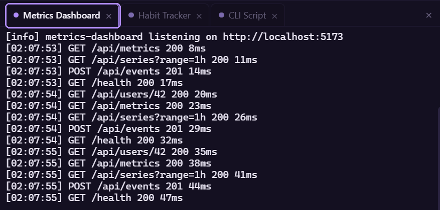

Each app runs in its own terminal tab in the CLI pane.

## Tabs



- Launching an app, or clicking its name in the sidebar, opens its tab. Clicking a name starts nothing; see [App states](/reference/glossary/#app-states).
- A dot on the tab is lit while the app is running.
- The **x** on a tab closes the tab. It does not stop the app. Click the name again to reopen the tab; it shows this session's log.

## Collapsing the pane

The **x** at the far right of the tab strip ("Hide CLI pane") collapses the CLI pane and shrinks the window to just the sidebar. Terminals keep running and keep their scrollback. A chevron appears beside the filter box to bring the pane back at its previous width. The chevron pulses when an update is waiting, because the update banner lives in the pane.

## Copy and paste

| Action | Result |
| --- | --- |
| Select text with the mouse | Copied to the clipboard on release, then the selection clears. |
| Middle-click | Pastes the clipboard into the terminal. |
| **Copy all** button (top right, appears on hover) | Copies the whole scrollback as text. |

## Scrollback

Each terminal keeps 10,000 lines.

## When a process ends

When the process exits, the terminal prints:

```text
[process exited]
```

The tab stays open with its output intact. The `[process exited]` line is shown in your
language.

## Restart

**Restart** (or Launch on a stopped app) starts a new run in the same tab. The tab is
rebuilt, and the earlier output of this session is replayed into it from the session log.

If the app already ran earlier in this session, Moonpool first writes a dim divider to the
session log, so it shows between the old output and the new run:

```text
---------- restarted 2026-10-05 09:14:02 ----------
```

If the new run begins by clearing the screen, the earlier output is pushed into scrollback
instead of being wiped.

## Session logs

Everything an app prints is also written to a log file under `cli-output\`, one file per app per Moonpool session. Location, retention and the **Keep app output logs between sessions** setting are in [Logs](/configuration/logs/).
