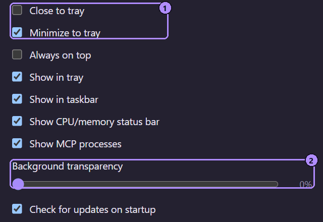

## Tray icon

| Action | Result |
| --- | --- |
| Left-click | Shows the hub window (restores it if minimized or hidden). |
| Right-click | Menu with **Show Moonpool** and **Quit** only (in your language). |

With several Moonpool copies running, each has its own tray icon. The tooltip says which copy
it is. See [Portable mode](/data/portable-mode/#several-copies-at-once).

## Quit

**Quit** exits Moonpool and, on Windows, stops every app Moonpool launched, including their
child processes. Apps that were already running before Moonpool saw them (shown as running
without "managed by Moonpool") are left alone. On Linux, quitting does not reliably
stop launched apps.

## Closing and minimizing

The close button quits Moonpool by default (`closeToTray` is `false`). Turn on **Close to
tray** in Settings and closing hides the window to the tray instead. Moonpool keeps running,
and the tray icon or **Show Moonpool** brings it back.

**Minimize to tray** (`minimizeToTray`, default on) hides the window to the tray when it is
minimized, and it leaves the taskbar. Turn it off to minimize to the taskbar as usual.

1. **Close to tray** and **Minimize to tray**.
2. **Background transparency**. See [Themes, language and transparency](/using/themes-and-language/#transparency).

## Tray and taskbar lockout

**Show in tray** and **Show in taskbar** control whether the tray icon and the taskbar button
are visible. At least one must stay on, otherwise a hidden window would have no way back.
When only one is on, its checkbox is disabled until you turn the other back on.

## Always on top

**Always on top** in Settings keeps every Moonpool window (the hub, Settings, About, the app
editor, the theme browser, the installer and Help) above other windows. It is off by
default.

## See also

- [Run an npm dev server in the background on Windows](/guides/run-npm-dev-server-in-background-windows/)
- [Start a script or dev server automatically at Windows login](/guides/start-app-at-windows-login/)
- [Settings window](/using/settings/)
- [The hub window](/using/hub-window/)
