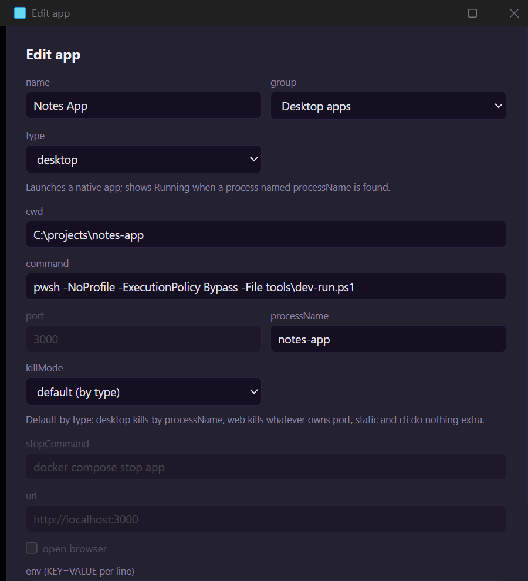

「編輯應用程式」對話方塊會以相同的名稱顯示相同的欄位。不適用於所選類型的欄位在對話方塊中會變暗，但仍會被儲存，只有一個例外：`stopCommand` 僅在 `killMode` 為 `command` 時才會儲存。



1. `killMode` 下拉選單。它用不到的欄位會維持變暗。

| 欄位 | 類型 | 必填 | 適用於 | 作用 |
| --- | --- | --- | --- | --- |
| `id` | string | 是 | 全部 | 唯一索引鍵。可用字母、數字、`.`、`_`、`-`，不得以 `-` 開頭。請參閱[概觀](/zh-hant/apps/apps-json/#id)。 |
| `name` | string | 是 | 全部 | 側邊欄中的標籤。不得為空白。 |
| `group` | string | 是 | 全部 | 應用程式在側邊欄中所屬的標題。手動編輯時不得為空白；對話方塊會把空白群組儲存為 `Apps`。可以是任意文字，新名稱會建立新群組。 |
| `type` | string | 是 | 全部 | `web`、`desktop`、`static` 或 `cli`。請參閱[應用程式類型](/zh-hant/apps/types/)。 |
| `command` | string | 除 `static` 外都必填 | 全部 | 在終端機中執行以啟動應用程式，Windows 上透過 `cmd /c`，其他系統透過 `$SHELL -c`（未設定 `SHELL` 時使用 `/bin/sh`）。對 `static` 是選用的。 |
| `cwd` | string | 否 | 所有帶 `command` 的類型 | 命令執行所在的資料夾。預設是 Moonpool 自己的工作資料夾。支援權杖與 `./`。請參閱[路徑與環境](/zh-hant/apps/paths-and-environment/)。 |
| `port` | integer，1 到 65535 | 否 | 任意 | 只要 localhost 上這個連接埠有回應（IPv4 或 IPv6）就算執行中。由 `killMode` 為 `port` 時讀取。 |
| `processName` | string | 否 | 任意，主要是 `desktop` | 只要存在使用此名稱的處理程序就算執行中。不分大小寫，有沒有 `.exe` 皆可，所以 `my-app` 能符合 `my-app.exe`。在 Linux 上不得超過 15 個字元。由 `killMode` 為 `processName` 時讀取。 |
| `mcpProcessName` | string | 否 | 任何帶 `processName` 的類型 | 此應用程式的 MCP 伺服器處理程序名稱所用的萬用字元模式。`*` 符合任意一段字元，`?` 符合單一字元。不分大小寫，與完整名稱比對，`.exe` 可省略。符合的處理程序會被視為該應用程式的 MCP 伺服器（側邊欄中的 MCP 子列），且不要求 `mcp` 作為它的第一個引數。請參閱 [mcpProcessName](#mcpprocessname)。 |
| `url` | string | 僅 `static` 必填 | `web`、`static` | 要開啟的頁面。只會開啟 `http://`、`https://`、`mailto:` 與 `file://` 網址。 |
| `openBrowser` | boolean，預設 `false` | 否 | 任何帶 `url` 的類型（對話方塊會對 `desktop` 與 `cli` 將其變暗） | 一旦 Moonpool 偵測到應用程式已就緒，就自動開啟 `url`（見下文）。 |
| `killMode` | string | 否 | 全部 | 停止與重新啟動時的額外清理：`processName`、`port`、`command` 或 `none`。請參閱[停止與重新啟動](/zh-hant/apps/stop-and-restart/)。 |
| `stopCommand` | string | 否 | `killMode` 為 `command` | 停止時執行的命令。在其他任何模式下都會被忽略。 |
| `env` | object of strings | 否 | 全部 | 額外的環境變數。對話方塊以每行一個 `KEY=VALUE` 的形式編輯它。 |
| `icon` | string | 否 | 全部 | 側邊欄影像：檔案路徑、`http(s)` 網址或 `data:` URI。可透過應用程式快顯功能表中的 **設定圖示...** 設定，也可以手動設定。 |
| `note` | string | 否 | 全部 | 在側邊欄中把滑鼠停留在應用程式上時顯示的提示。 |

一個使用了 `env` 與 `killMode` 的項目：

```json title="apps.json"
{
  "id": "api",
  "name": "API",
  "group": "Web apps",
  "type": "web",
  "command": "npm start",
  "port": 3000,
  "env": { "PORT": "3000", "NODE_ENV": "development" },
  "killMode": "port"
}
```

`port` 與 `killMode` 如何搭配運作，請見[找出並結束佔用連接埠的處理程序](/zh-hant/guides/find-and-kill-process-using-port-windows/)。

## mcpProcessName

預設情況下，當某個處理程序的名稱符合 `processName`，且它的第一個引數是 `mcp`（例如 `notes-app.exe mcp`）時，Moonpool 會把它視為該應用程式的 MCP 伺服器。當伺服器以不同的名稱執行時，請設定 `mcpProcessName`：例如應用程式監看的是一個執行檔，而它的 MCP 伺服器是另一個（`mog.exe mcp`），或是伺服器的一份改過名稱的副本。

該值是一個萬用字元模式。`*` 符合任意一段字元（包括空的），`?` 恰好符合一個字元。它會與完整的處理程序名稱以不分大小寫的方式比對，不含 `.exe` 的模式也能符合含 `.exe` 的名稱。空值視為未設定。

```json
{
  "id": "destiny",
  "name": "Destiny",
  "group": "Desktop apps",
  "type": "desktop",
  "processName": "destiny",
  "mcpProcessName": "destiny-mcp-*"
}
```

這能符合改過名稱的副本，例如 `destiny-mcp-2706210170.exe`。符合 `mcpProcessName` 的處理程序無論是否以 `mcp` 引數啟動，都算伺服器，而且絕不會被當作應用程式本身在執行。如果該模式同時也符合 `processName` 本身（例如 `destiny*`），Moonpool 仍然要求帶有 `mcp` 引數，這樣真正的應用程式就絕不會被誤認為它的 MCP 伺服器。請參閱 [MCP 設定](/zh-hant/automation/mcp-setup/#有自己-mcp-伺服器的應用程式)。

## openBrowser

當一個由 Moonpool 啟動的應用程式第一次顯示為「執行中」時，Moonpool 會開啟一次 `url`。這需要有 `port` 或 `processName` 才能偵測到。如果兩者都沒有，「執行中」只代表終端機處理程序還活著，瀏覽器不會自動開啟。如果你的命令自己會開啟瀏覽器，請關閉 `openBrowser`。沒有命令的 `static` 項目，無論 `openBrowser` 為何，每次按下啟動都會開啟 `url`。

兩個設定了相同 `port` 的應用程式會在側邊欄中被標示出來。

## 圖示

應用程式的圖示取下列第一個存在的：

1. `icon` 欄位。
2. 設定資料夾中的 `icons\<id>.<ext>`，例如 `icons\site.png`。
3. 應用程式自己資料夾（它的 `cwd`，或 `file:///` `url` 所在的資料夾）中的圖示檔案。
4. 對 `desktop`，取它已建置或正在執行的 `.exe` 的圖示。
5. 對 `web` 與 `static`，在伺服器就緒後取網站的 `/favicon.ico`。
6. 該類型對應的字形。

大多數應用程式都不需要設定圖示。
