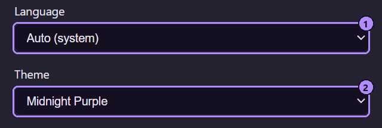

佈景主題、語言與透明度都在[設定視窗](/zh-hant/using/settings/)中設定。三者都會立即套用到每個開啟的 Moonpool 視窗。



1. 語言選擇器。
2. 佈景主題按鈕。它顯示目前佈景主題的名稱，並開啟佈景主題瀏覽器。

## 佈景主題

佈景主題瀏覽器是一個獨立的視窗。每個佈景主題有一張預覽卡片，用該佈景主題自己的顏色繪製（文字、面板、輸入欄位、按鈕、狀態圓點、儀表漸層與 16 色終端機色盤），並依基礎、霓虹、暖色、冷色、綠色系、中性、淺色、腮紅、明亮、淺粉彩與粉彩分組。按一下某張卡片即可套用：每個開啟的 Moonpool 視窗會同時改變，而且選擇會被儲存。這個視窗會保持開啟，方便你比較；按 Esc 關閉。

共有 68 個佈景主題外加「自動」，其中約一半是淺色的。佈景主題的名稱是專有名詞，不翻譯；只有「自動（依系統）」、「深色」與「淺色」會翻譯。

**自動（依系統）** 會跟隨作業系統的淺色或深色偏好，並在系統切換時即時切換。其他任何選擇都是固定的。終端機的 16 種 ANSI 顏色也會跟隨佈景主題。

如果你儲存過舊版本的佈景主題，它會被保留。儲存的名稱如果 Moonpool 已不認得，就會退回到「自動」。有些標籤與以前不同（例如 Matrix 現在標為 Terminal，Nord 是 Arctic，Dracula 是 Nocturne，Gruvbox 是 Retro，Solarized 是 Solar），但儲存的選擇本身不變。

佈景主題儲存在 webview 的 `localStorage` 中，而不是 `settings.json`。如果儲存空間無法使用，就退回到「自動」。

```text
localStorage key: moonpool.theme
```

## 語言

「自動」會跟隨作業系統的語言。否則請從 14 種語言中選一種，每種都以它自己的語言顯示：

```text
English, Deutsch, Español, Français, Italiano, 日本語, 한국어, Nederlands, Polski,
Português (Brasil), Русский, Türkçe, 简体中文, 繁體中文
```

選擇器會立即套用到主視窗與其他視窗。所選語言會以 `locale` 儲存在 `settings.json` 中。

## 透明度

**背景透明度** 讓視窗背景變得半透明，範圍從 0%（不透明）到 90%。

- 把指標移到視窗上會立刻讓它變為完全不透明。指標離開後，它會在大約 2 秒內漸變回你設定的值。
- 終端機跟隨相同的色調，而不會自己再加一層。
- 每個視窗（主視窗、設定、關於、應用程式編輯器與佈景主題瀏覽器）都會自行套用該設定，而且你拖曳滑桿時，設定視窗會即時更新其他視窗。

## 介面縮放

用 Ctrl + 滑鼠滾輪縮放整個介面。沒有鍵盤縮放。請參閱[快速鍵與縮放](/zh-hant/using/keyboard-shortcuts/)。

## 另請參閱

- [設定視窗](/zh-hant/using/settings/)
- [快速鍵與縮放](/zh-hant/using/keyboard-shortcuts/)
